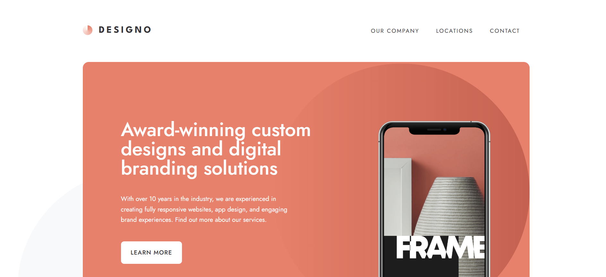

# Designo multi-page website

Voici ma solution pour le challenge "Designo multi-page website" !

---

## 🌐 Site

[👉 Voir le site](https://sayaka68.github.io/designo---Frontend-Mentor/)

---

## ⚙️ Technologies utilisées

- HTML / SCSS
- JavaScript
- EJS
- gulp
- JSON
- GAS + google spreadsheets

---

## 📚 Ce que j'ai appris pour ce projet

- Découpage de templates avec EJS
- Chargement et gestion de données au format JSON
- Communication asynchrone avec fetch
- Mise en place d’un formulaire connecté à Google Apps Script et à une feuille de calcul

---

## 📜 Dépôt GitHub

[Voir ce dépôt](https://github.com/sayaka68/designo/tree/main)
